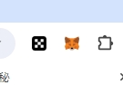
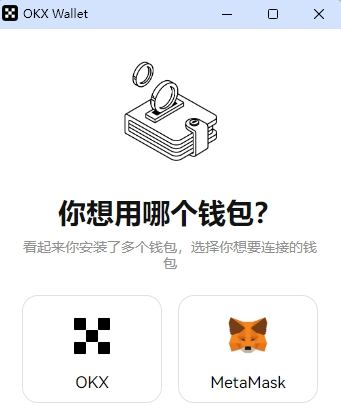
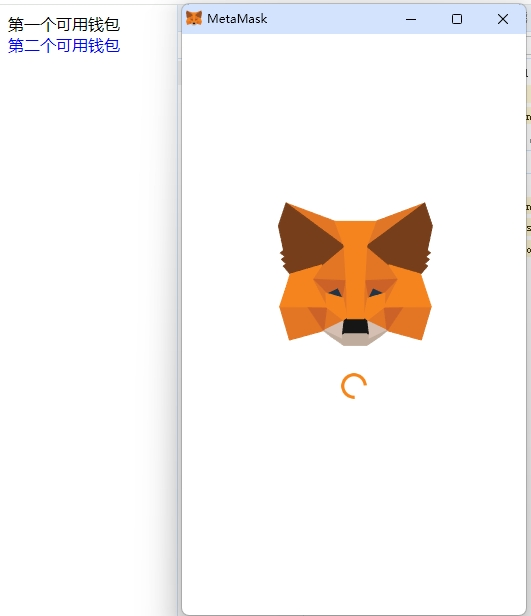
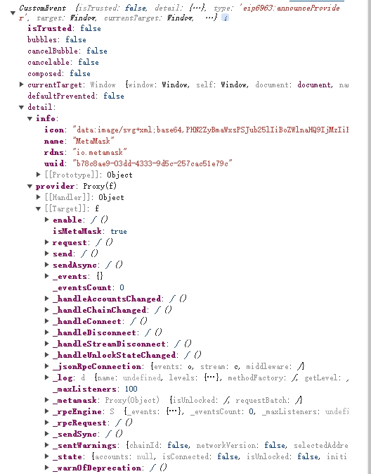

# EIP6963

EIP6963 是插件钱包规范，用于解决多个钱包之间注入全局变量冲突的问题

由于各钱包没有统一的规范，在 EIP6963 之前均是在所有页面的 window.ethereum 下注入对应实例即方法实现与页面交互，但是在安装多个钱包插件后会产生冲突



如上：我添加了两个硬件钱包，当调用 window.ethereum 试图唤起 metaMask 时，被 okxWallet 询问打开实例



这是我们不想看到的，我们希望能够直接打开 metaMask，对此需要使用 EIP6963 实现区分钱包及其实例（provider）。

## EIP6963 规范

-所有支持该规范的插件钱包在监听到"eip6963:requestProvider"事件触发时，会发送"eip6963:announceProvider"事件，参数 event.detail 为钱包 info 和 Provide，因此我们可以先监听"eip6963:announceProvider"事件，并在需要可用钱包信息时发送"eip6963:requestProvider"事件并，提供者添加到数组中;

```javascript
let walletList = [];

const addToWalletList = (event) => {
  walletList.push(event.detail);
};

window.addEventListener("eip6963:announceProvider", getWalletList);
window.dispatchEvent(new Event("eip6963:requestProvider"));

// 打开钱包的方法
const openWallet = (index) => {
  walletList[index].provider.request({
    method: "eth_requestAccounts",
  });
};
```

这里例子是在页面初始化时监听并发送事件，并将参数保存到数组中。通过 openWallet 去请求钱包处理

因为数组第二个才是 metaMask 的信息，所以我们点击第二个文本, 可以看到不再通过 OKX 询问，而是直接打开，EIP6963 基本介绍到此结束。



### Even 返回数据如下：



可以看到 info 中包含钱包的基本信息，provider 与传统的 window.ethereum 类似，应该可以使用 Ethers 的 BrowserProvider 接管以方便操作插件钱包。

**_粗斜体文本_**

index.html 有简单源码，还有许多地方可以优化，例如使用 uuid: value 结构去防止重复添加钱包实例。
